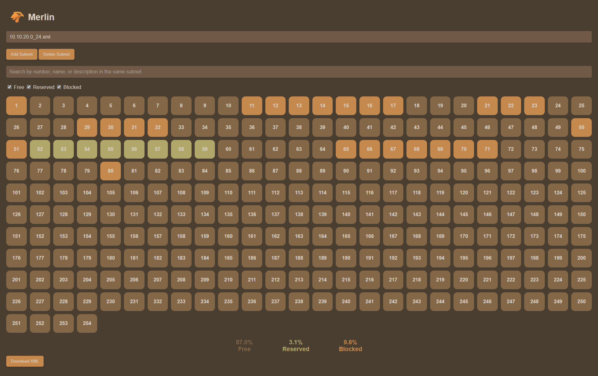

# 🧙‍♂️ Merlin: Your Homelab IP Management Tool

Welcome to **Merlin**! This intuitive web application is designed to simplify and streamline IP management for your homelab. Whether you’re running a small network or an extensive home setup, Merlin provides the tools you need to organize and monitor your IP addresses effortlessly.

<div align="center">
    🌐 <a href="https://merlin-demo.calma-media.com/" target="_blank"><strong>Check Out the Live Demo</strong></a> 🌐
</div>

## 🚀 Features

- **Add and Manage Subnets** ➕: Effortlessly add multiple subnets and delete them when needed.

<div align="center">
    
</div>

- **IP Details and Customization** 📝: Assign names, descriptions, and links to specific IP addresses.
- **IP Status Management** ✅: Mark IPs as **Free**, **Reserved**, or **Blocked** for easy identification.
- **Efficient Filtering and Searching** 🔍: Quickly find and filter IPs based on your criteria.
- **Export Subnets** 📄: Download your subnet data as XML files for easy backup and sharing.
- **Statistics Overview** 📊: View a summary of free, reserved, and blocked IP addresses to monitor your network's usage.
- **Fully Optimized for Mobile and Any Screen Size** 📱: Enjoy a seamless experience on any device, from smartphones to large monitors.

With Merlin, managing your homelab IP addresses has never been so organized and efficient!

## 📜 Patch Notes

Stay informed about Merlin's updates and features:

- **1.0**: 🧙‍♂️ **Initial Release**: Welcome to Merlin, your new homelab IP management assistant!

## 🎨 Customization Guide

Merlin allows you to personalize the appearance of your web app. Customize colors easily through the `stylesheets/colors.css` file to fit your preferred style:

```css
:root {
  /* Scrollbar colors */
  --color-scrollbar-track: #4a3e31;           /* Background color of the scrollbar track */
  --color-scrollbar-thumb: #705a47;           /* Default color of the scrollbar thumb */
  --color-scrollbar-thumb-hover: #a86f4e;     /* Hover color for the scrollbar thumb */

  /* Header background */
  --color-header-bg: #4a3e31;                 /* Background color for the header */

  /* IP status colors */
  --color-free: #836746;                      /* Color representing a free IP */
  --color-reserved: #b2a76b;                  /* Color representing a reserved IP */
  --color-blocked: #c5894d;                   /* Color representing a blocked IP */

  /* General background and text colors */
  --color-background: #4a3e31;                /* Background color for the main content */
  --background-image: none;                   /* Background image setting */
  --color-text: #d8cfc4;                      /* Main text color */

  /* Placeholder text color */
  --color-placeholder-text: #a89f94;          /* Color for placeholder text in input fields */

  /* Modal colors */
  --color-modal-background: #5c4b3e;          /* Background color for box dialogs */
  --color-modal-text: #d8cfc4;                /* Text color inside boxes */
  --color-tile-text: #d8cfc4;                 /* Text color for tiles or cards */

  /* Button colors */
  --color-button-bg: #c5894d;                 /* Default button background color */
  --color-button-bg-hover: #836746;           /* Button background color on hover */
  --color-button-text: #d8cfc4;               /* Button text color */

  /* Search bar colors */
  --color-searchbar: #705a47;                 /* Background color of the search bar */
  --color-searchbar-text: #d8cfc4;            /* Text color inside the search bar */
}
```

Adjust these variables to change the colors of your app elements, giving Merlin a look that suits your personal or homelab theme!
